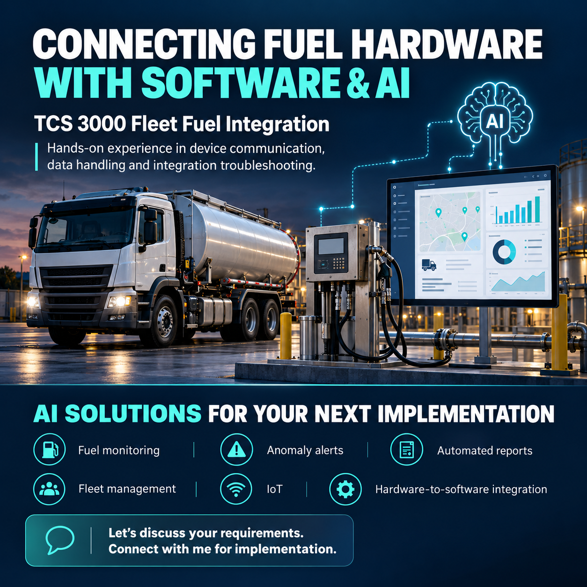
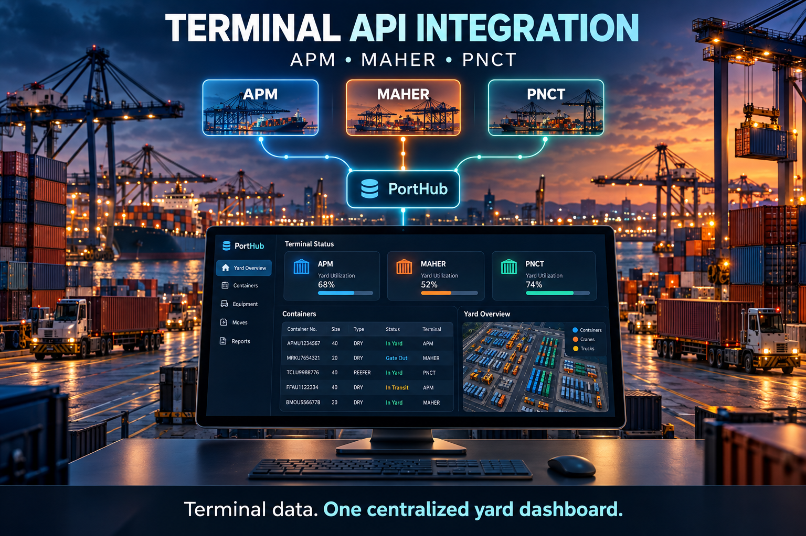
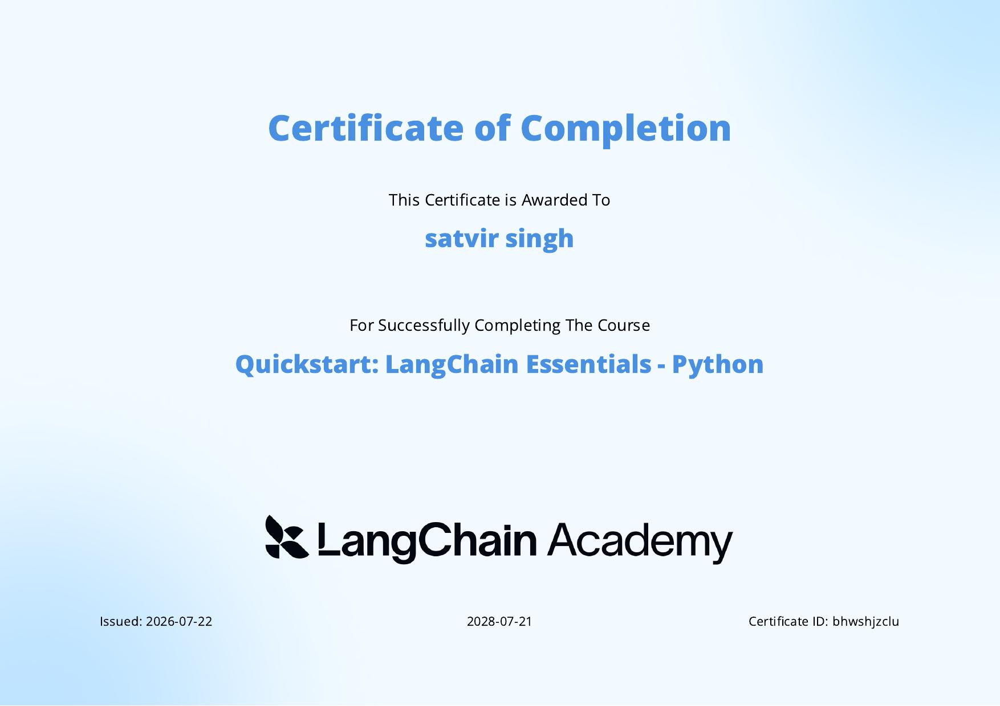
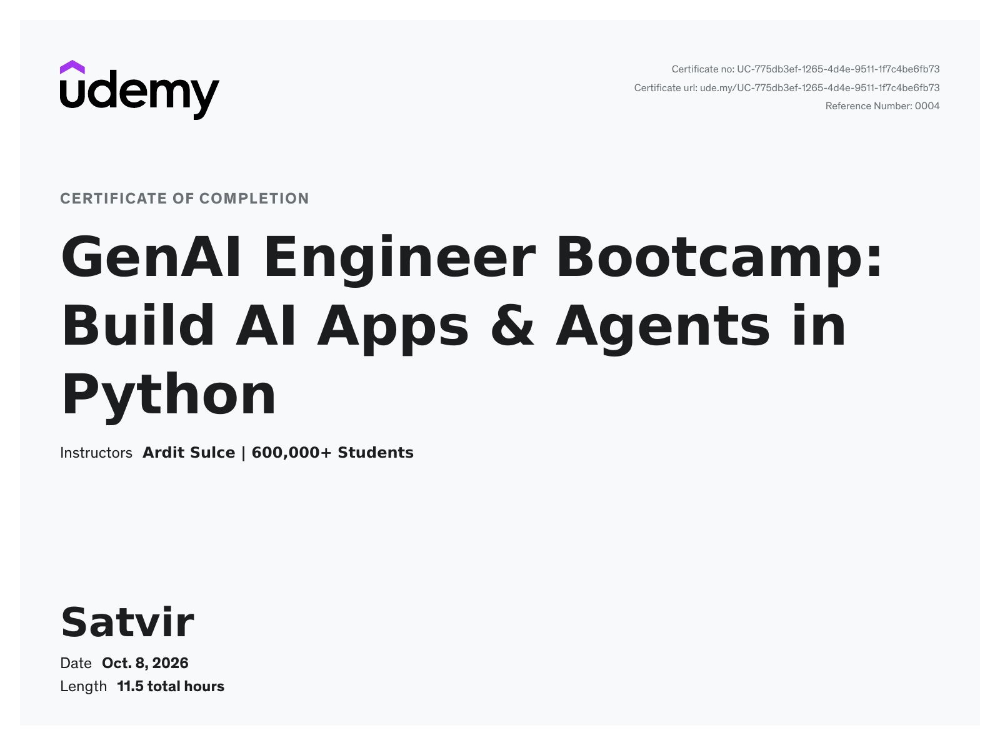
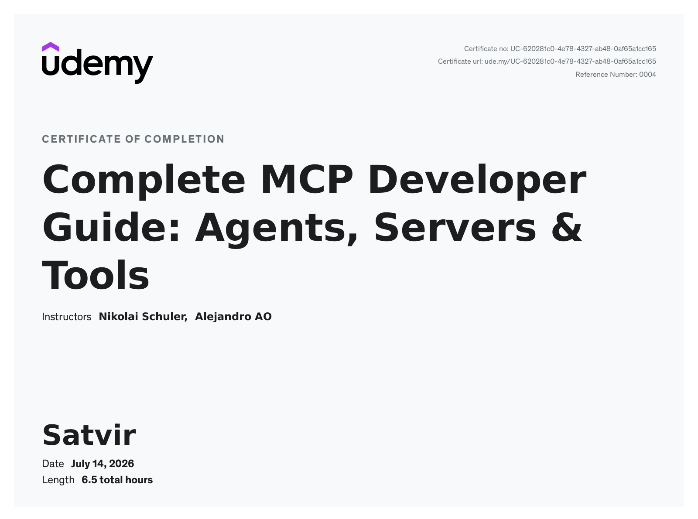
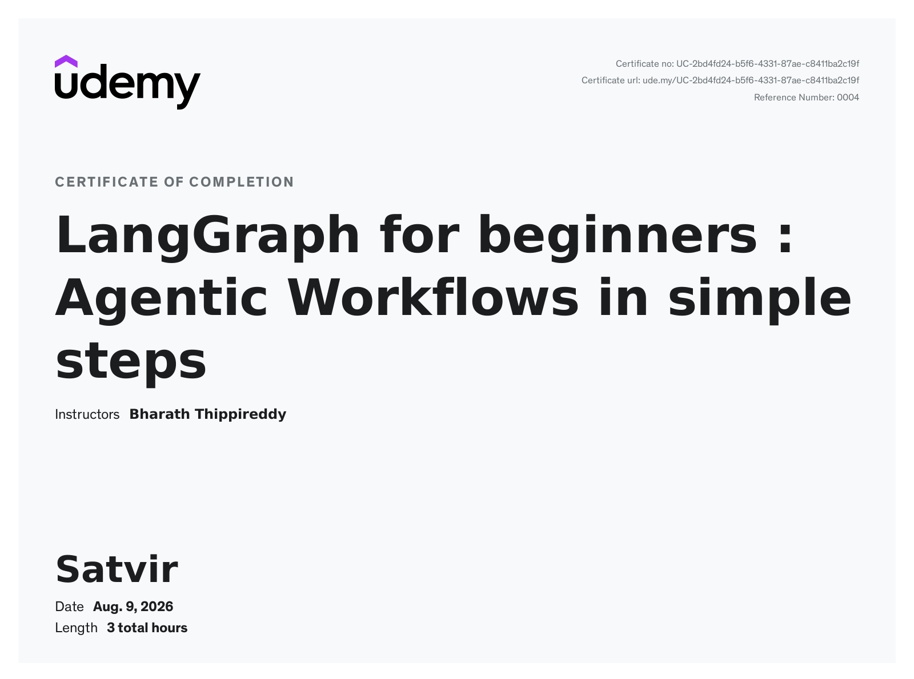

# Hi, I'm Satvir 👋

**Project Manager | Python & AI Automation | Embedded Systems / IoT**

I build practical AI systems using Python, local LLMs, RAG, agentic workflows,
MCP and embedded/IoT technologies. I have 14+ years of experience across project
coordination, Python development, QA, hardware communication, API integrations,
GPS tracking and production troubleshooting.

Based in Sirhind Mandi, Fatehgarh Sahib, Punjab, India.

## 🚀 Featured Projects

### TCS 3000 Fleet Fuel Integration

- Developed a Python interface for the TCS 3000 Electronic Register using its technical documentation.
- Synchronized delivery tickets to a web interface.
- Implemented web API commands to start, stop and pause delivery operations.
- Worked hands-on with device communication, data handling and integration troubleshooting.

### Veeder-Root Fuel Tank Data Reports

- Parsed Veeder-Root automatic tank gauge data.
- Connected tank inventory, delivery readings and sensor data to a web application.
- Generated reports for operational monitoring and industrial IoT workflows.

### PortHub Yard Dashboard

- Integrated APIs from APM Terminals, PNCT and Maher Terminals into PortHub.
- Consolidated terminal status, yard utilization and operational data in a single web interface.
- Supported cleaner visibility for terminal, container and yard workflows.

### Load and Driver GPS Tracking

- Built GPS tracking workflows that collected sensor data and transmitted it through cURL requests.
- Used MapKit JS to display driver locations and route/geofence context.
- Calculated working and rest hours inside designated geofenced areas.

### AI Ticket Merge & Test Workflow

**Python, LangGraph, Git, local LLMs, Playwright**

Designed a human-in-the-loop workflow to merge PHP and frontend ticket branches
locally, analyze Git diffs, generate screen-impact reports, request merge
confirmation, create test plans and optionally run browser tests.

### Construction PDF Analysis

**Python, PyMuPDF, FastAPI, document automation**

Built OpenAI-assisted workflows for construction plansheet PDFs: splitting PDFs
into pages, converting pages to images, predicting drawing titles and numbers
from user-selected examples and predicting specification codes from specification
documents.

### Local AI Assistant

**Ollama, Streamlit, SQLite, local voice tooling**

Built a local-first assistant concept with model selection, persistent
conversations, vision input, project-aware file access and safe command
execution without cloud API keys or telemetry.

### IoT and GPS Tracking Systems

- Built GPS tracking workflows that collect sensor data and transmit it through cURL requests.
- Used MapKit JS to display driver locations and calculate working/rest hours inside geofenced areas.
- Worked with ESP32, SIM7000G, MQTT, cellular IoT and GPS-based telemetry.

## 🧰 Experience Highlights

**Project Manager / Python Developer**  
NAM Software Solutions | June 2020 - August 2026

- Planned and coordinated software projects, aligned client requirements with developers and resolved implementation queries.
- Integrated APIs from APM Terminals, PNCT and Maher Terminals into PortHub.
- Built AWS Lambda functions for PDF operations using YAML configuration and Docker container images.
- Implemented PDF annotation features, including signatures and A4 export.
- Performed Jira ticket validation, functional testing, regression testing and defect verification.
- Supported Git-based ticket analysis, merge review, impact reporting and test planning.
- Provided remote troubleshooting and production support for clients and internal teams.

**Project Coordinator**  
Zenus Infotech India Pvt. Ltd. | November 2016 - May 2020

- Coordinated projects, resources, schedules and client communication.
- Tracked open items, clarified priorities and supported cross-functional delivery.

**Embedded Systems and Python Developer**  
GadgetBytes.in | May 2012 - May 2016

- Developed embedded and server-client communication solutions using RS232, RS485, Python and PHP APIs.
- Integrated hardware devices with backend programs and communication protocols.

## 🛠️ Technologies

**AI & Python:** Python, LangChain, LangGraph, Agno, local LLMs, Ollama, FastAPI, Pydantic, AI workflow automation  
**Web & Data:** CodeIgniter 3, PHP APIs, Django, MySQL, REST APIs, Postman, web scraping, PyMuPDF  
**QA & Delivery:** Jira, regression testing, defect reporting, Git merge analysis, client support, project coordination  
**Embedded & IoT:** Arduino, Raspberry Pi, MQTT, CAN bus, RS232, RS485, BLE, GSM, XBee, sensors, serial communication  
**Cloud & Tools:** Docker, Git, GitHub, AWS Lambda, AWS email operations, Twilio APIs, Playwright fundamentals

## 🔧 Freelance Embedded Systems & IoT

- Arduino UNO integrations with GSM, RF 434 MHz, XBee, touchscreen, PIR, photosensor, ultrasonic sensor, DC motor control and remote LED systems.
- Arduino builds including 8x8 LED matrix games, 4x4x4 LED cube and slump-meter development.
- Raspberry Pi and communication projects including Veeder-Root parsing, BLE, Hologram cellular IoT and Python/MATLAB serial integration.
- Automation and API workflows using Twilio SMS/voice, Hologram API/SDK and CAN-bus experimentation.

## 📚 Currently Learning

- Advanced agent architectures and multi-agent systems
- Model Context Protocol (MCP) integrations
- Production-ready RAG evaluation and monitoring
- Edge AI for embedded and IoT devices

## 🏅 Certifications

### Quickstart: LangChain Essentials - Python

### GenAI Engineer Bootcamp: Build AI Apps & Agents in Python

### Complete MCP Developer Guide: Agents, Servers & Tools

### LangGraph for beginners: Agentic Workflows in simple steps

## 🎓 Education

- **B.Tech in Electronics Engineering**, B.C.E.T. College, Bhutta | 2008 - 2012
- **Senior Secondary (Non-Medical)**, PSEB | 2008
- **Matriculation**, PSEB | 2006

## 📫 Contact

- GitHub: [@vampiresati](https://github.com/vampiresati)
- LinkedIn: [@satvir-singh-95101222a](https://www.linkedin.com/in/satvir-singh-95101222a)
- Email: [sssatvir12@gmail.com](mailto:sssatvir12@gmail.com)
- Phone: +91 98884 85649
